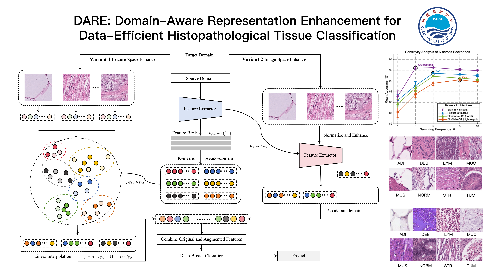

# Chihchin RONG

---

## Quick Intro

- 🎓 I'm an undergraduate student majoring in **Mathematics and Applied Mathematics**.
- 🌱 My interests and learning focus are: **Deep Learning**, **Image Recognition & Classification**, especially on **mathematical modeling and statistical theory** to mitigate **domain shift** challenges in computer vision tasks.
- 🏆 In mathematical modeling competitions, my main focus is **Problem B (CUMMCM)** and **Problem D (MCM/ICM)**, specializing in the Optimization/OR direction.
- 🏅 **Competition Achievements**:
  - **2024 MCM/ICM**: Meritorious Winner (Paper Open Sourced)
  - **2025 CUMCM**: National Second Prize
- 📫 How to reach me: **rzj@stu.ouc.edu.cn**
- 💬 Ask me about: Any of the topics above!

###  Research & Projects

####  Ongoing Research
**Computational Biology: Batch Effect Removal**
* **Focus:** Addressing domain shift challenges in computational biology.
* **Methodology:** Leveraging mathematical modeling, including Bayesian estimation, regression analysis, and other statistical approaches to mitigate technical variation.

####  Completed Projects

<table>
  <tr>
  <td width="30%" valign="middle" align="center">
    
  </td>
    <td width="70%" valign="top">
      <h3><a href="https://github.com/AndyRong921/DARE">DARE: Domain-Aware Representation Enhancement for Data-Efficient Histopathological Tissue Classification</a></h3>
      

        <b>Focus:</b> Addressing domain shiftin medical image classification tasks under small-sample constraints, achieving high-performance results via data-efficient learning strategies.
      

      

        
        
        
        
      

      

        <i>This repository provides the official implementation of DARE. Efficiently tackling domain adaptation in histopathological analysis.</i>
      

    </td>
  </tr>
</table>

---
  
## Github Insights

  
  

  

  

  

# Repositories

These repositories are currently finished and would not have big changes recently:

